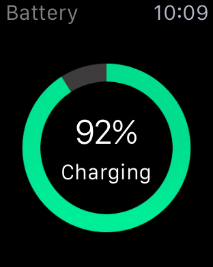
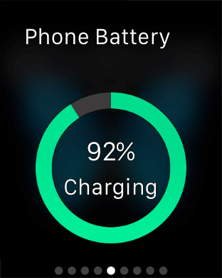
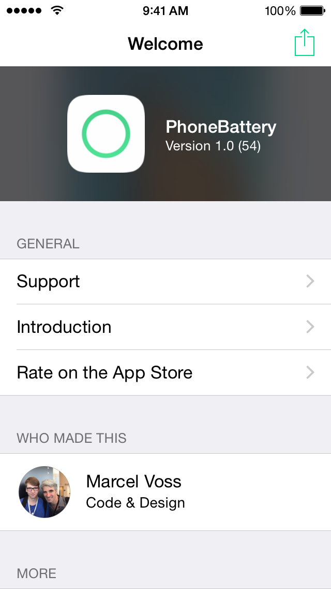

# PhoneBattery
PhoneBattery is a simple utility that lets you check your phone's battery life on your Apple Watch. It is very simple and doesn't do anything else than that.

PhoneBattery is also **available for free** on the [App Store](https://itunes.apple.com/us/app/phonebattery-your-phones-battery/id1009278300?ls=1&mt=8)!

I had the initial idea for this on the plane from WWDC back to Germany, polished it at home and here it is now. Please let me know what you think of it!

### Localization
| Language |  Localizer                                      |
|----------|------------------------------------------------ |
| German   | [Marcel Voss](https://github.com/marcelvoss)    |
| French   | [Julia Grill](https://github.com/juliastic)     |
| Spanish  | [Faisal Misle](https://github.com/fm)           |
| Italian  | [Giovanni Trezzi](https://twitter.com/yoller_)  |
| Chinese (Simplified) | [Jurvis Tan](https://twitter.com/jurvistan)  |
| Chinese (Traditional)  | [Jurvis Tan](https://twitter.com/jurvistan)  |

Thanks to everyone!

## Other Contributers
Thanks to [Joe Dawson](http://joedawson.me) who created PhoneBattery's gorgeous icon.

## Preview

## License
PhoneBattery 1.x is available under the MIT license. See the [LICENSE](https://github.com/marcelvoss/PhoneBattery/blob/master/LICENSE.md) file for more information.
